---

## 팀원 정보

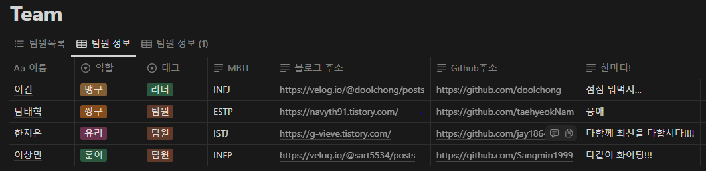

### 1. 프로젝트

- **프로젝트 명 : 맹9칭9**
- **한 줄 정리 : 친구들의 게시글을 한 눈에 볼 수 있는 프로그램**
- **내용 : 떡잎마을 방범대 친구들의 최근 소식을 알 수 있고 좋아요와 댓글을 통해 친구들과 소통할 수 있습니다!**
- **기능**
    1. **사용자 인증(로그인 및 회원가입)**
    2. **프로필 관리**
    3. **친구**
    4. **게시글&댓글(전체유저)**
    5. **뉴스피드(친구, 1시간)**
    6. **인기게시글: 오늘의 떡잎마을 핫이슈(전체유저, 좋아요, 1일)**
    7. **좋아요**

**🗃️ Github**

[GitHub - doolchong/Maeng9-news-feed](https://github.com/doolchong/Maeng9-news-feed)

**📽️ 시연 영상**

[뉴스피드 프로젝트 맹9조(9조) 시연영상](https://www.youtube.com/watch?v=oG-93OL90-I)

**🗒️ 발표 자료**

https://docs.google.com/presentation/d/1hZcU27n_A6LtsmD3sXJhFT_JjATnEvjs/edit?usp=sharing&ouid=108650959611092731737&rtpof=true&sd=true

---

### 🏝️ Ground Rules

```
10:00 데일리 스크름(개인 학습 및 개발 진행상황 공유)
12:00 ~ 13:00(점심시간)
17:00 ~ 18:00(저녁시간)
```

### 🚩 Goals

```
다 같이 과제에서 역할을 맡아서 수행하기
```

### 🚦 Project Rules

- 📌 **Code Convention**

  https://naver.github.io/hackday-conventions-java/

  https://programmer-ririhan.tistory.com/337

    - 정적 팩토리 메소드 최대한 사용해보기

  

  객체를 생성할 때 매개변수는 최대한 객체로 받아오기

- 📌 **Github Rules**

  **깃허브 브랜치 규칙**

    - dev - 기본 개발 브랜치
    - feat - 기능 개발 브랜치
        - feat/user
    - fix - 기능개발 후 오류 수정 브랜치
        - fix/user

  **깃 커밋 규칙**

    - 인텔리제이 플러그인 설치, 같은 규격 사용합시다~!~!

      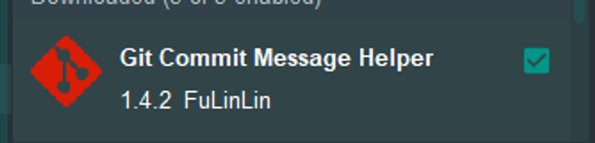

        - 메세지

          | 작업 타입 | 작업내용 |
                                                                                                                                                                                                                                                                                                                        | --- | --- |
          | ✨ feat | 해당 파일에 새로운 기능이 생김 |
          | 🎉 add | 없던 파일을 생성함, 초기 세팅 |
          | 🐛 bugfix | 버그 수정 |
          | ♻️ refactor | 코드 리팩토링 |
          | 🩹 fix | 코드 수정 |
          | 🚚 move | 파일 옮김/정리 |
          | 🔥 del | 기능/파일을 삭제 |
          | 🍻 test | 테스트 코드를 작성 |
          | 💄 style | css |
          | 🙈 gitfix | gitignore 수정 |
          | 🔨script | package.json 변경(npm 설치 등) |

### 2. WBS & 트러블 슈팅

[📅 WBS]

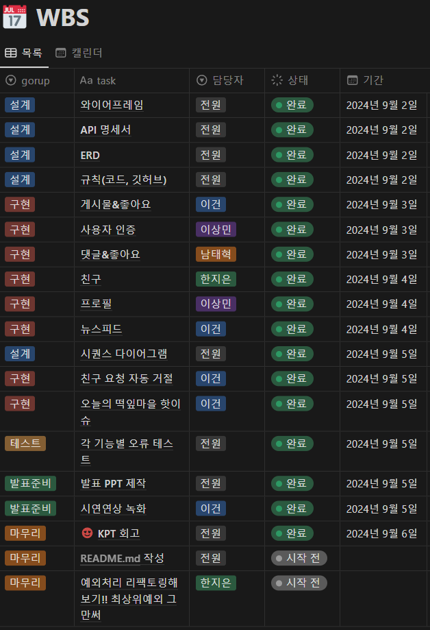

[🔥 트러블슈팅 기록]

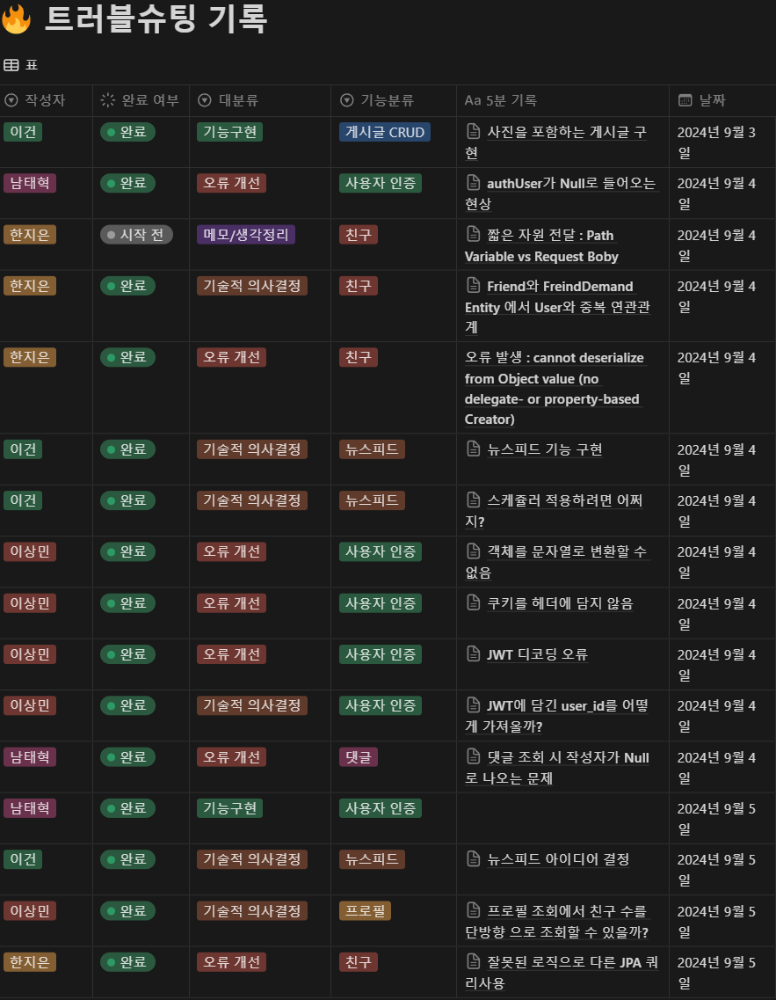

### 3. 와이어프레임 & 플로우차트

📌 **와이어프레임

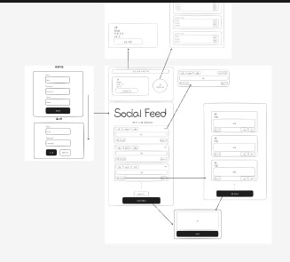

[https://www.figma.com/design/nIPdaCY37yJptX6cUyWOfG/맹9-뉴스피드?node-id=0-1&node-type=CANVAS&t=PYDI5B4nuWdo5vJy-0](https://www.figma.com/design/nIPdaCY37yJptX6cUyWOfG/%EB%A7%B99-%EB%89%B4%EC%8A%A4%ED%94%BC%EB%93%9C?node-id=0-1&node-type=CANVAS&t=PYDI5B4nuWdo5vJy-0)

https://www.figma.com/embed?embed_host=notion&url=https%3A%2F%2Fwww.figma.com%2Fdesign%2FnIPdaCY37yJptX6cUyWOfG%2F%EB%A7%B99-%EB%89%B4%EC%8A%A4%ED%94%BC%EB%93%9C%3Fnode-id%3D0-1%26m%3Ddev%26t%3DPYDI5B4nuWdo5vJy-1

https://excalidraw.com/#room=1b3833da89884218d8ca,wGYGNEw1pWEVgvTr1zKLLw

**📌 시퀀스 다이어그램 (복잡한 기능만)**

- **사용자 관리 기능**
    - **로그인**

      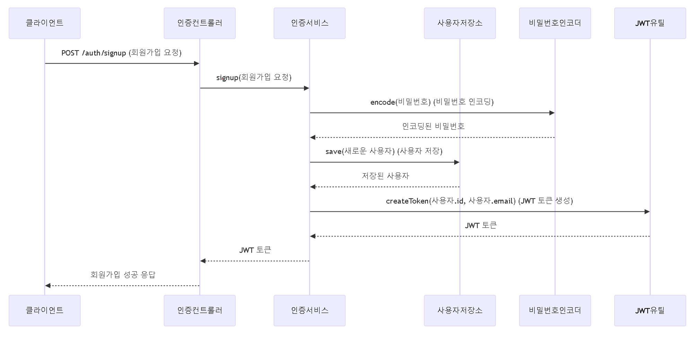

    - **회원가입**

      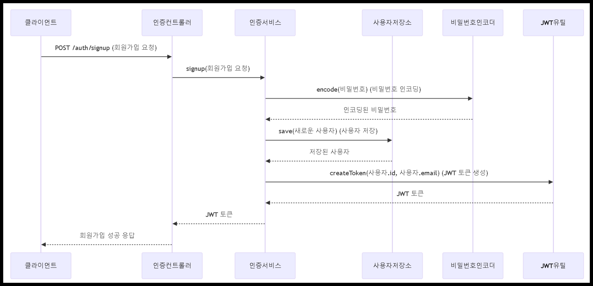

    - **로그아웃**

      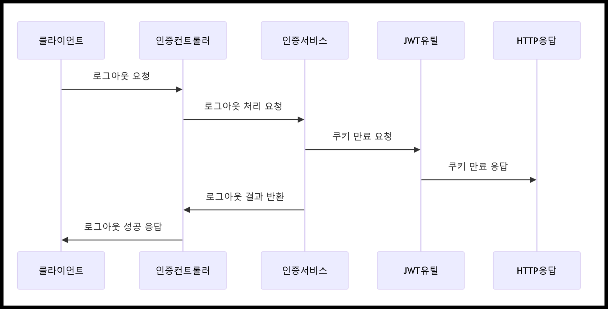

- **친구 기능**
    - **친구 추가 신청**

      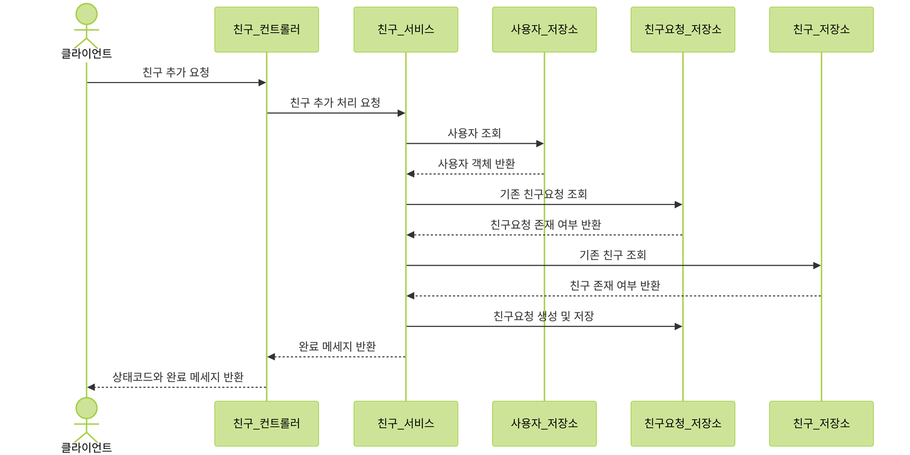

    - **친구 신청 수락**

      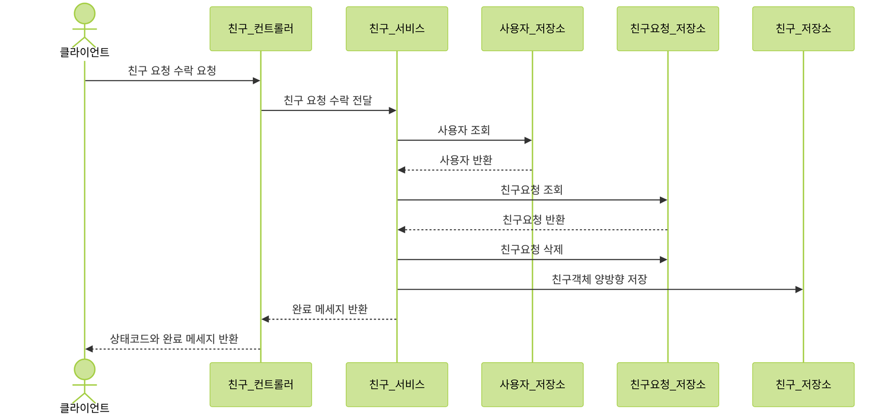

### 4. API 명세서 (구현 기능 안에 상세 설명 추가)

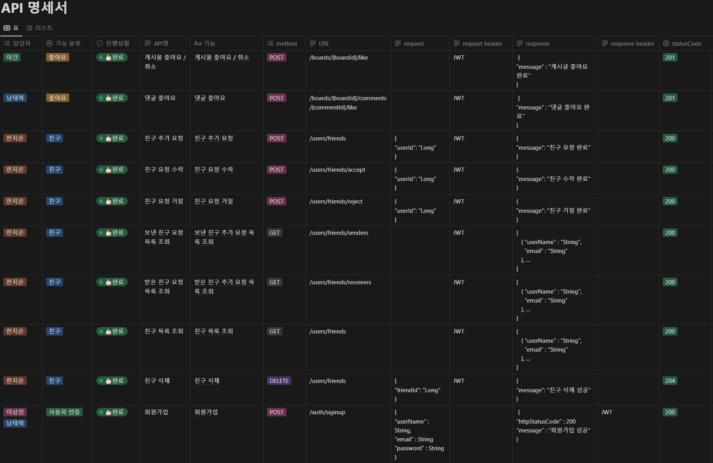
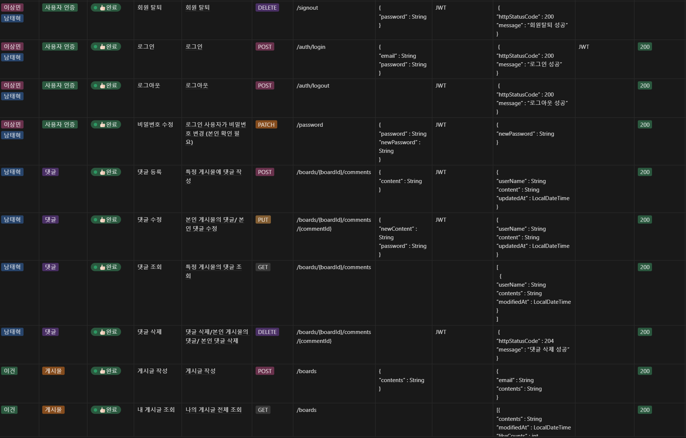
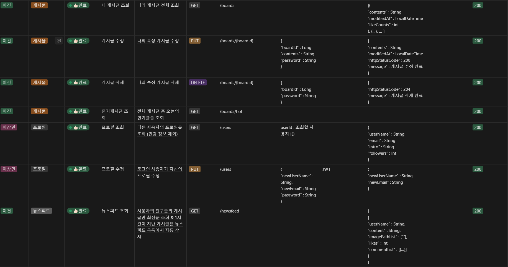

### 5. ERD DIAGRAM

[뉴스피드 프로젝트](https://www.erdcloud.com/d/jt8QWRCkZhPFBPr82)

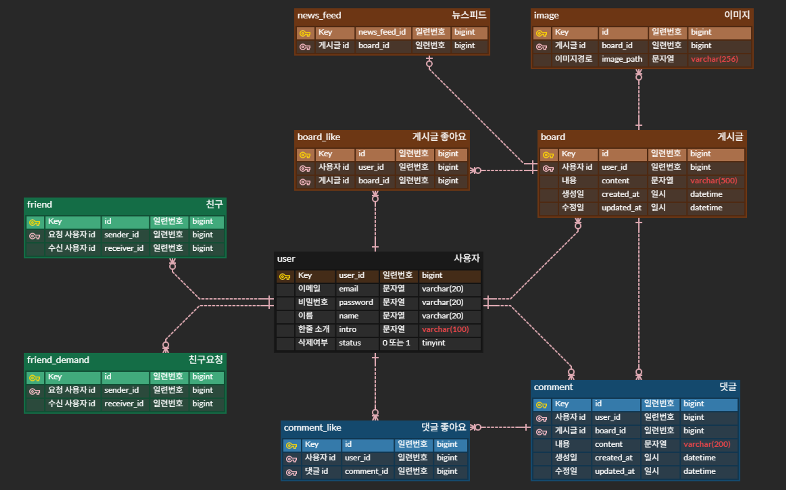

- **Entity**

  •User Entity

  | Column | 타입 |
  | --- | --- |
  | ID | bigint |
  | email | varchar |
  | password | varchar |
  | 이름 | varchar |
  | 삭제 여부 | tinyint |
  | 한 줄 소개 | varchar |

  • Board Entity

  | Column | 타입 |
  | --- | --- |
  | ID | bigint |
  | user_id | bigint |
  | 내용 | varchar |
  | 생성일 | datetime |
  | 수정일 | datetime |

  • Comment Entity

  | Column | 타입 |
  | --- | --- |
  | ID | bigint |
  | user_id | bigint |
  | board_id | bigint |
  | content | varchar |
  | 생성일 | datetime |
  | 수정일 | datetime |

  • Friend Entity

  | Column | 타입 |
  | --- | --- |
  | ID | bigint |
  | sender_id | bigint |
  | receiver_id | bigint |
  | 친구상태 | tinyint |

- • Friend Demand Entity

  | Column | 타입 |
  | --- | --- |
  | ID | bigint |
  | sender_id | bigint |
  | receiver_id | bigint |

    - Board Like Entity

  | Column | 타입 |
  | --- | --- |
  | ID | bigint |
  | board_id | bigint |
  | user_id | bigint |

    - Comment Like Entity

  | Column | 타입 |
  | --- | --- |
  | ID | bigint |
  | comment_id | bigint |
  | user_id | bigint |
